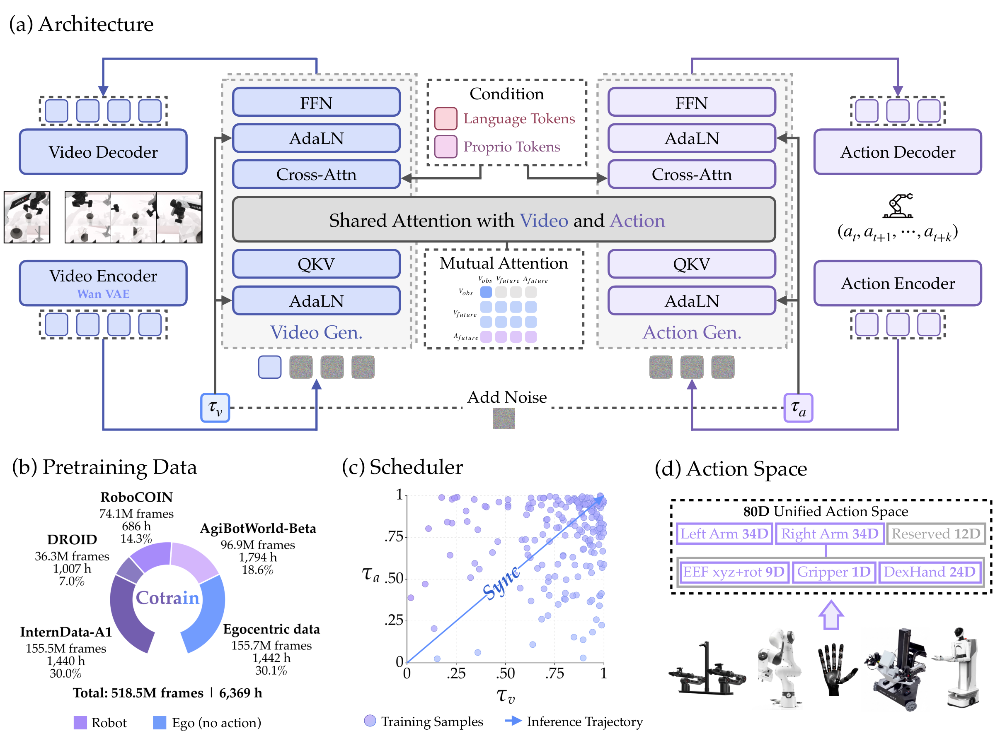

# OpenWAM：把世界动作模型拆成可控的预训练实验

> 这一页回答：当视频生成、动作生成和跨本体数据被放进同一个WAM时，怎样把架构选择变成可复查的实验变量，而不是只比较一个不可拆分的模型名称。

OpenWAM的贡献不只是发布一个叫OpenWAM-alpha的策略，而是把研究对象分成三层。OpenWAM-Infra提供可组合的模型、数据、训练、推理、部署和评测接口；OpenWAM-Study用受控实验研究“继承什么视频知识、世界与动作怎样交互、协同收益怎样随规模变化”；OpenWAM-alpha再把这些原则组合成一个大规模预训练WAM。因此，阅读这篇论文时应把“研究栈的开放性”和“alpha模型在特定基准上的结果”分开记录。

## 核心图与信号流

> **主要方法图：** 官方项目页的Figure 12，展示视频生成流、ActionDiT动作流、语言与本体状态条件、互注意力掩码、同步去噪、数据构成和80维统一动作空间。来源：[官方方法图](https://openwam-official.github.io/figs/architecture.png)。图中同时含架构、预训练数据和动作空间面板，不能只把左上角当成完整部署图。

OpenWAM面对的问题是：已有世界动作模型往往把视频骨干、视觉潜变量、动作专家、信息流、推理去噪过程和数据配方一起改动，结果很难判断收益究竟来自大骨干、动作容量、掩码、数据规模还是工程调度。Infra的价值在于保持接口和评测口径，再替换这些模块。论文总结的设计原则包括：上游视频知识需要足够强的生成骨干和信息密集的潜空间；世界动作协同需要专门的动作容量、明确的世界到动作信息流和同步联合去噪；具身预训练的主要收益更可能体现在域外泛化，而不是只在训练分布内记忆动作。

## 输入、输出与控制接口

一次策略调用的条件包括语言指令、当前视觉观察和机器人本体状态。不同本体的动作字段被放入80维统一动作空间，图中示例把左右手臂各分配34维，保留12维，并在其中表达末端位姿、夹爪或灵巧手等语义。这样做的重点不是把所有机器人强行变成同一台机器，而是让未激活的字段有固定位置和有效性约定，训练时可以跨单臂、双臂和灵巧手共享接口。

训练输出有两个相关但不等价的结果：视频流解码未来视觉帧或潜变量，动作流解码未来动作块。动作块最终仍要经过目标机器人的动作解释器、逆运动学、关节控制或其他低层执行接口；论文没有因为ActionDiT存在就声称直接输出电机力矩。项目图中的视频输出是世界预测支路，动作输出才是这页所在的“动作生成与通用策略”主产物。

## 训练与推理

OpenWAM-alpha以Wan2.2-VAE等视频潜空间为基础，使用视频生成DiT和专门的ActionDiT。训练时对视频未来帧和动作块加入噪声，让两条流在共享注意力中联合去噪；语言token和本体状态token作为条件，互注意力掩码规定视频、观察和动作token之间的可见范围。掩码的作用是建立可用的信息流并防止目标泄漏，不是让动作分支无条件读取未来真值。项目页描述的推理过程使用同步去噪调度，使视频和动作处在相互对齐的时间进度上，再由动作解码器给出可执行动作块。

数据配方采用一阶段协同训练，官方页面给出的总量约为518.5M帧、6369小时，约七成是机器人数据，约三成是无动作的第一视角人类数据。公开架构图列出的来源包括RoboCOIN、DROID、AgiBotWorld-Beta、InternData-A1和egocentric data。人类视频补充物体交互、工具使用和场景覆盖，机器人轨迹提供动作锚点；两者在同一预训练程序中的比例和质量仍然是需要单独做消融的变量。部署时不能把训练用的动作编码器、未来目标或评测标签误当成额外输入。仓库还给出了推理和部署脚本，但具体本体映射、相机配置、低层控制器和安全状态机仍属于系统集成工作。

## 实验条件与证据

论文报告了8个仿真基准，以及覆盖单臂、双臂和灵巧手的真机实验。双臂RoboDojo包含18个任务，官方项目页报告OpenWAM-alpha平均得分37.6、成功率24.4%，对比的下一名约为22.9和12.8。灵巧手实验强调目标本体没有出现在预训练混合中，动作接口包含21个手部自由度以及6维末端位姿；这可以作为跨本体迁移证据，但不能等同于任意机器人零样本部署。真机结果还覆盖单臂夹爪、双臂和灵巧手，读者应继续查每个平台的相机、动作频率、重置方式和成功定义。

复现条件本身很重。官方仓库的环境要求包括Python 3.10以上、PyTorch 2.7.1和CUDA 12.8，并建议用8张80GB显卡训练Wan2.2-5B规模模型。仓库根目录是Apache-2.0，但模型权重、基础骨干、数据和第三方依赖的许可需要分别核对；Apache许可不能自动覆盖外部数据。即使仓库同时提供Infra、基准、配置和检查点下载器，也不能只凭“有代码”推断已经在任意硬件上完整可复现。

## 边界与开发建议

首先，OpenWAM证明的是一套在其数据和基准协议下更容易研究的WAM栈，不是已经解决全身平衡、接触保护或移动操作的低层控制器。80维动作空间需要逐字段验证坐标系、旋转表示、关节顺序、单位、无效字段和动作块时域；把末端目标交给IK或WBC时，还要测试延迟、限位、碰撞和失败恢复。其次，518.5M帧不是518.5M条同质的状态-动作-触觉轨迹，第一视角视频和机器人记录的监督密度不同，不能用总小时数替代动作覆盖率。

建议先用Infra固定本体、数据切分、随机种子和控制器，做四组最小对照：仅机器人动作、加入第一视角视频、加入专门动作容量、改变视频-动作掩码或去噪调度。每组同时记录域内成功率、未见物体或背景成功率、端到端延迟、动作抖动和低层保护触发。若要迁移到人形机器人，应先在静止基座上验证动作字段和控制闭环，再加入移动、双臂接触和灵巧手负载；生成的未来视频只能作为训练或推理信号，不能替代真机反馈。

## 原始来源

- [论文与版本历史](https://arxiv.org/abs/2609.07398)
- [官方项目页](https://openwam-official.github.io/)
- [官方代码仓库](https://github.com/OpenWAM-Official/OpenWAM)
- [官方架构图](https://openwam-official.github.io/figs/architecture.png)
