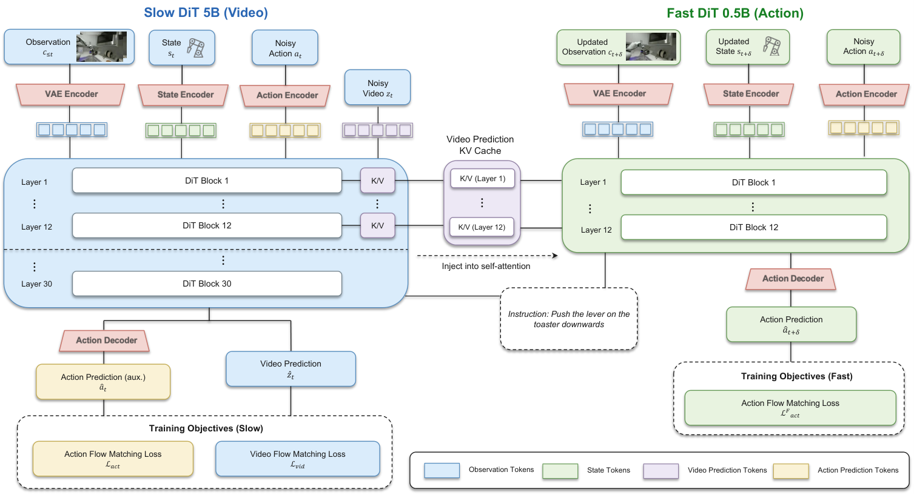

# ZimaBlue：让大规模无动作视频进入可部署的WAM

> 这一页回答：动作标签稀缺时，第一视角视频预训练怎样转成目标机器人动作，以及Slow世界模型和Fast动作分支怎样共同满足闭环延迟。

ZimaBlue把泛化问题表述为三阶段课程，而不是简单把更多视频拼到动作数据旁边。第一阶段在人体和机器人第一视角视频上学习因果视觉动态；第二阶段用异构机器人轨迹把视觉动态接到统一状态-动作接口；第三阶段针对目标机器人后训练并引入Fast分支。论文的结论是，视频量可以显著改善目标机器人的未见任务表现，但视频本身没有关节动作标签，必须经过第二阶段的本体和时序对齐才能进入控制闭环。

## 核心图与双速系统

> **主要方法图：** arXiv HTML的Figure 2，展示Slow DiT 5B负责视频与动作建模，Fast DiT 0.5B从Slow前12层的K/V缓存接收视频预测表示，并在更新的观察和状态上直接生成动作。来源：[论文原图](https://arxiv.org/html/2609.00188v1/main_architecture_2.png)。

在线输入包括当前相机观察、本体状态和语言指令；实际部署还需要固定相机数量、视角、帧率以及目标机器人的关节顺序。模型用统一的100维状态-动作表示承载多种本体，字段包含左右末端位姿、夹爪、双臂关节、躯干、移动底盘/辅助字段和灵巧手关节，并用零值加有效性掩码表示未激活部位。动作块相对初始本体状态编码，位置和旋转使用相对表示，部署时再恢复到目标机器人单位。输出是目标本体可解释的动作块，不是未来视频帧本身；Slow分支输出视频与动作表征，Fast分支输出最终动作。

## 三阶段训练

阶段I从Wan2.2-TI2V-5B等视频生成初始化出发，在EPIC-KITCHENS、EgoDex、HOT3D-Aria、DreamDojo以及多种机器人第一视角视频上做因果视频预训练。这一阶段重点学习物体、接触和长时动作的视觉变化，不应被计作同等规模的状态-动作轨迹。阶段II加入DROID、AgiBot、Galaxea、RoboMIND2-Franka等同步视频/状态/动作/指令记录，用统一接口进行视频-动作中训练：Slow分支同时承担未来视频和动作损失，视觉知识才被约束到机器人动作语义。阶段III在目标机器人数据上后训练，并训练轻量Fast分支。

Slow DiT是高容量世界表征模型，Fast DiT约0.5B，只使用Slow前12层的键值缓存注入自注意力，避免部署时重新完整生成未来视频。Fast训练时对动作块做偏移，并用teacher-forced前缀维持连续性；之后还可用DMD把Slow和Fast的去噪步数蒸馏到两步，并使用CUDA Graph降低调度开销。图中的K/V缓存、视频预测和动作预测均是时序契约的一部分，不能只移植Fast网络而忽略缓存层、动作偏移和有效性掩码。

## 实验条件与结果

真机实验以7自由度Franka为目标机器人，Standard设置含8项任务，Perturbed设置含4项任务，通常每项10次，Toys任务使用30个物体摆放。只用目标机器人数据时成功率为36.1%，加入多本体数据后为46.1%，加入约6万小时视频后为66.9%，加入超过12万小时具身视频后为77.8%。表中Slow、双速和DMD版本的延迟分别约为449.6毫秒、145.6毫秒和33毫秒；后者是指定硬件和测量口径下的推理数字，不代表任意控制器都能以30Hz稳定闭环。扰动任务的成功数仍明显低于标准任务，失败需要继续按进度、接触和观测时序拆解。

论文还在RoboTwin 2.0和RoboCasa365等仿真环境报告结果，包括未见组合和随机化场景。仿真增益不能直接替代真机，因为统一动作表示、视觉域差异、相机外参、关节限位和低层控制器都可能改变结果。尤其是“超过120000小时视频”描述的是跨来源视频规模，不能按120000小时动作监督理解。对于工程团队，真正需要复现的最小单元是目标机器人后训练、动作字段映射、Slow到Fast缓存和部署测时。

## 开放状态、边界与开发建议

本次核验的官方GitHub仓库只有README和`assets/teaser.png`，README把后续阶段标为coming soon，没有训练代码、权重或完整配置。因此，仓库存在不等于ZimaBlue当前可复现；论文中的三阶段数据清单和数值也不意味着这些数据都随仓库发布。官方仓库是论文提供的代码入口，但截至2026-09-11不应把它记成完整开源训练框架。

方法边界还包括：目标机器人后训练使最终结果不是对任意本体的纯零样本；视频预训练主要塑造视觉动态，动作输出依赖阶段II和III的接口对齐；Fast分支追求低延迟，却牺牲了直接用完整Slow模型进行未来生成的容量。开发时建议先用少量同步轨迹验证100维字段、零值/有效性掩码、旋转和单位，再单独比较Slow、缓存Fast和DMD的动作连续性。评测要同时记录视频预测损失、动作误差、成功率、端到端延迟、缓存失效、相机时钟漂移和保护触发，避免把数据规模的相关性写成必然的因果收益。人形机器人接入时仍需由IK、PD、WBC或其他身体控制器完成平衡、接触和关节安全。

## 原始来源

- [论文与版本历史](https://arxiv.org/abs/2609.00188)
- [论文HTML全文](https://arxiv.org/html/2609.00188v1)
- [官方代码仓库](https://github.com/ZimaBlue-WAM/ZimaBlue)
- [官方方法图](https://arxiv.org/html/2609.00188v1/main_architecture_2.png)
