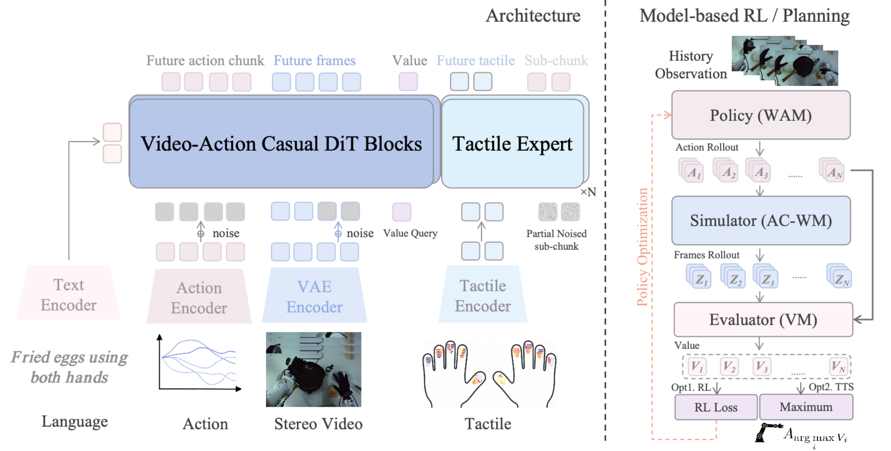

# Motus2：把策略、动作条件世界模型和价值评估放进一个闭环

> 这一页回答：一个共享参数的模型怎样同时预测候选动作的后果、评估其价值并改进策略，以及论文中的大幅SFT数字与MBRL收益分别来自哪里。

Motus2放在“物理世界建模与预测”，因为它的模拟器接收候选动作并预测未来视觉状态，评估器再对这些后果给出价值。它不是只把World Model当作宣传名称：系统显式区分策略WAM、动作条件世界模型AC-WM和价值模型VM。不过三者共享主干参数、通过不同的token和注意力掩码进入不同模式，所谓模拟器是视觉潜空间的动作条件预测器，不是带可验证质量、摩擦和接触参数的传统物理引擎。

## 核心图与闭环

> **主要方法图：** 官方项目页Figure 1，左侧展示视频-动作-触觉输入和共享的因果DiT，右侧展示策略提出多个动作块、模拟器生成未来帧、评估器打分，再用于规划或策略优化。来源：[官方方法图](https://motus-robotics.github.io/motus2/assets/img/latest/motus2_overview.png)。

策略输入语言、历史视觉观察和机器人状态，输出候选动作块。模拟器接收历史和动作条件，输出候选动作下的未来视觉潜变量；评估器读取模拟结果，输出价值或任务进度分数。在线Best-of-N流程先采样N个候选，逐个想象和评分，执行最高分动作块，然后等待新的真实观察再滚动规划。这个重新观测步骤很重要，因为模型想象并不等于环境真值，长时预测误差不能无限累积。

系统还加入触觉专家，使用过去的触觉窗口修正动作子块。未来力信号只用于训练，部署时使用的是实际触觉输入和修正后的动作，并不把未来触觉当作已知条件。记忆默认是有界滑动窗口；全局自回归会增加上下文成本，Hybrid Memory保留初始锚点、近期完整帧和较早的压缩token。观察到的真实视觉和模型想象的视觉在部署语义上必须分开，否则价值评估会被自己的错误预测反复强化。

## 训练信号与自演化

Motus2的共享模型以动作优先、跨chunk因果的掩码组织三个接口，并为策略、模拟器和评估器启用不同损失门控。精选成功轨迹主要提供动作学习监督；失败、次优或与任务无关的交互不被简单丢弃，而是用于学习动作条件动态和价值。数据课程从大规模单目第一视角视频开始，扩展到同步立体第一视角，再加入机器人轨迹和人机对齐。项目与论文给出的规模约为13万小时人类/具身视频，机器人域和对齐数据超过100小时，但小时数之间的动作和触觉监督密度不同。

MBRL部分采用DiffusionNFT把评估器的价值信号转成策略更新，模拟器和评估器在一轮策略更新中固定，并由异步Ray流水线执行候选生成、视觉rollout、评分和更新。另一个推理时规划消融只做Best-of-N，不更新策略。因而“自演化”在论文实验中包含受控的离线/仿真策略优化，不应解释成机器人在真机上自动修改参数后立即继续运行；真正的L3更新仍需要数据筛选、回归测试、安全审查和版本回滚。

## 实验数字怎样读

最容易误读的是84%。论文主表在同一目标机器人、五项任务和20次rollout的匹配目标机器人SFT协议下，WAN-SFT为0%，Pretrain-SFT为51%，Motus2 Midtrain-SFT达到84%平均成功率，五项任务包括Place Ball、Multi-Finger、Attach Eraser、Screw Bulb和Put Phone。84%是五任务SFT的结果，不是MBRL带来的收益，也不是全系统在任意任务上的成功率。

MBRL与规划的单独消融只覆盖Put Phone和Multi-Finger两个任务、每个条件20次rollout：同一目标检查点为65%，只加规划为67.5%，只加MBRL为72.5%，同时加MBRL和规划为75.0%。因此可以说在该受控两任务实验里MBRL带来7.5个百分点、组合方案带来10个百分点，但不能把这个小规模增益外推成84%到75%的关系，更不能用五任务SFT数代替物理后果预测指标。长时记忆、触觉和平台实验还应按各自表格的任务、窗口和控制频率复查。

## 边界、开放状态与开发建议

官方项目页目前把Code和Model都标为Soon，因此截至2026-09-11没有可核验的公开训练代码或权重；项目页演示和论文数字不能作为完整复现入口。MBRL消融只有两个任务，且依赖已有目标机器人检查点、模拟器/评估器和候选采样协议。预测的是视觉后果与价值，不代表模型已经掌握可解释的物理参数；遇到接触、遮挡、物体不可逆变化时，应检查预测偏差和候选排序校准。

开发时建议把系统拆成四套回归：离线动作条件预测，离线价值排序，仿真中的Best-of-N闭环，以及真机只执行不更新的安全回放。对每个候选保存动作、预测帧、价值、真实下一帧和执行结果，计算排序相关性、动作分布外程度和想象-真实偏差。再分别开关全局/滑窗/混合记忆、触觉修正、MBRL和规划，防止共享参数带来的收益归因不清。真机先设置固定候选数、动作块时域、超时和低价值拒绝策略，所有动作仍经过本体控制器、限位、碰撞和急停链路。

## 原始来源

- [论文与v2版本历史](https://arxiv.org/abs/2608.30237v2)
- [论文HTML全文](https://arxiv.org/html/2608.30237v2)
- [官方项目页](https://motus-robotics.github.io/motus2/)
- [官方方法图](https://motus-robotics.github.io/motus2/assets/img/latest/motus2_overview.png)
