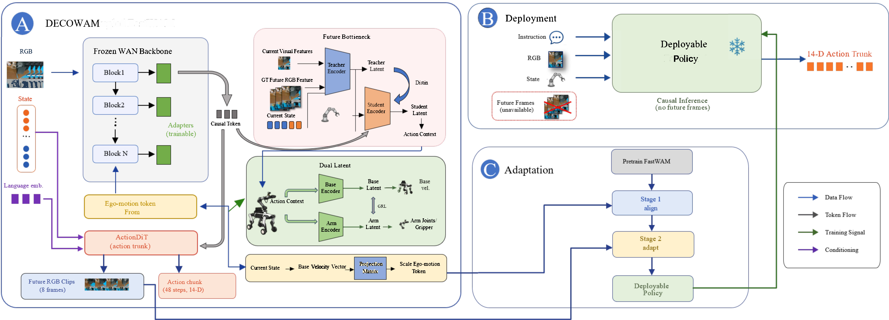

# DECOWAM：用未来蒸馏与动作解耦适配腿式移动操作

> 论文原图：DECOWAM 的冻结 FastWAM、未来瓶颈、基座/机械臂潜变量解耦与部署时因果推理总览。

## 核心问题

DECOWAM 针对腿式或轮腿式移动操作中的一个具体失配：固定基座的 World Action Model 可以把当前图像、语言和机器人状态映射到未来视频与动作，但在机器人移动时，相机自运动、底盘速度和机械臂动作会同时改变画面。若把这些因素压进一个没有结构的动作条件，模型可能把“底盘向前走造成的视野变化”误当成“手臂在操作”，从而影响未来观测预测和全身协调。论文提出的不是一个重新定义所有控制器的系统，而是在预训练 FastWAM 上增加残差适配器，并用动作等价的未来瓶颈和基座/机械臂双潜变量给这个失配加结构约束。

## 输入、输出与信号流

训练样本的当前输入包括语言指令 l、当前 RGB 图像 x0 和 14 维机器人状态 s0。动作目标是长度 K=48 的 14 维归一化动作块：6 维机械臂目标、1 维夹爪、3 维底盘速度 vx/vy/ωz，以及用于接口对齐的 4 维填充位；这些填充位不能被误解为四个额外的可控执行器。模型同时学习未来 RGB 帧，因此训练阶段的输出是未来视觉序列和动作块。未来瓶颈的教师分支可以读当前与未来视觉以及状态，学生分支只读当前视觉和状态；部署时仅保留学生条件，未来帧和特权教师均被移除。论文还把底盘速度作为动作目标和视频条件，使相机运动有一个明确的可解释输入。

## 训练与推理

训练分两阶段。第一阶段在 ARMDOG 数据上用 50,000 步适配 FastWAM 的全部参数，让原有模型先进入移动操作数据分布。第二阶段冻结第一阶段得到的主干，只训练残差适配器、128 维动作等价瓶颈、16 维基座/机械臂潜变量以及基座速度条件模块，总计约 25.95M 个可训练参数，而论文给出的完整 FastWAM 参数规模约为 6020.75M。损失同时覆盖视频流匹配、动作流匹配、未来瓶颈对齐和解耦约束；基座/机械臂潜变量通过梯度反转式对抗分离，减少一个潜变量泄露另一个动作因素的机会。

推理是严格因果的：每个控制周期只读当前 RGB、状态和语言，ActionDiT 输出 48 步动作块，机器人底层接口再执行对应的机械臂、夹爪和底盘命令。图中的教师未来帧只服务于训练期蒸馏，因此 DECOWAM 的运行时成本不等于“在线生成未来视频再规划”。这点对部署估算很重要，也解释了为什么它更适合被看成带结构化训练信号的移动操作策略，而不是一个在运行时显式搜索未来轨迹的规划器。

## 数据与实验条件

ARMDOG 是同步记录的移动操作数据集，平台为带 6 自由度机械臂和 1 自由度夹爪的轮腿机器人，另有 16 个腿关节；数据包含 RGB-D、本体状态、IMU、底盘状态、全身命令和语言，频率为 15 Hz。论文报告质量筛选后的完整数据为 1,487 个 episode、343,550 帧、约 321.3 分钟，覆盖五类任务；模型第二阶段使用的子集为 214 个 episode、26 个任务。离线 Box-val replay 使用 23 个 episode、8 个任务和 4,323 帧，按统一窗口比较 FastWAM 与 DECOWAM。

在 replay 上，DECOWAM 的未来帧 MSE 为 8.77e-4、PSNR 为 31.663、动作 MSE 为 5.38e-5；FastWAM 对应为 1.032e-3、31.441 和 6.87e-5，动作 MSE 下降约 21.71%，未来帧 MSE 下降约 15.03%。真机闭环共按每种方法 79 次试验，DECOWAM 完成 46/79，即 58.2%，平均完成时间 49 秒；FastWAM 为 57.0%。因此这里最稳妥的结论是整体成功率略高，同时论文的基座位移、全身协调等诊断更有优势，不能把 58.2% 写成对 FastWAM 的压倒性提升。论文中的 BD-SR、WBCM-SR、BDP-SR 和 AR-SR 是特定扰动或协调诊断指标，也不是任务成功率。

## 边界与开发建议

第一，公开论文没有给出已核验的 DECOWAM 训练代码或权重，复现需要自行准备 ARMDOG 同步数据、FastWAM 基座和移动平台，不能因为有方法图就标为开源可复现。第二，数据和真机实验围绕单一平台、有限任务和 14 维接口展开，不能直接外推到人形全身力矩控制、复杂接触或不同相机安装。第三，replay 的视频/动作误差与真机闭环成功率属于不同证据层级，应在评测表中分开记录。

工程上若要借鉴，优先保留“底盘速度显式条件 + 未来视觉教师、当前观测学生”的训练分工，并先做相机自运动与机械臂动作的可辨识性检查，再决定是否引入对抗解耦。底盘命令仍应经过独立的运动控制和安全限幅；模型输出不应绕过腿式稳定控制器。报告结果时同时给 replay、全身扰动诊断和真机任务成功率，才能判断收益来自视觉预测、动作表示还是执行器接口。

## 读图与复现重点

图中最容易被忽略的是训练和部署并不是同一条输入路径。训练左侧的教师能够看到未来帧，所以未来瓶颈只是一种 privileged supervision；部署右侧只有当前观测，不能把未来图像接回控制环。基座与机械臂潜变量也不是两个独立策略，而是从同一个动作和视觉表征中通过分离约束得到的辅助因素。复现时应分别记录第一阶段全量适配和第二阶段冻结主干的参数更新范围，否则直接从随机初始化训练解耦模块，得到的结果不能与论文的 FastWAM 迁移设定相比较。

从工程接口看，14 维动作中真正代表底盘的只有三维速度，腿部稳定、足端落点和倾倒恢复仍在模型之外。ARMDOG 的 RGB、IMU、本体状态和动作时间戳必须对齐，尤其是底盘速度与相机帧的延迟；只用同步不充分的公开视频替换这些信号，可能会把时间错位误判为模型解耦失败。建议先做固定底盘、仅机械臂、仅底盘和同时移动四组对照，再在相同的 79 次试验协议下报告成功率与失败原因。这样才能判断 DECOWAM 的增益是否来自显式自运动条件，而不是数据清洗、控制器调参或任务分布差异。

## 官方来源

- [arXiv 摘要页](https://arxiv.org/abs/2608.20114)
- [arXiv HTML 正文与 Figure 1](https://arxiv.org/html/2608.20114v2)
