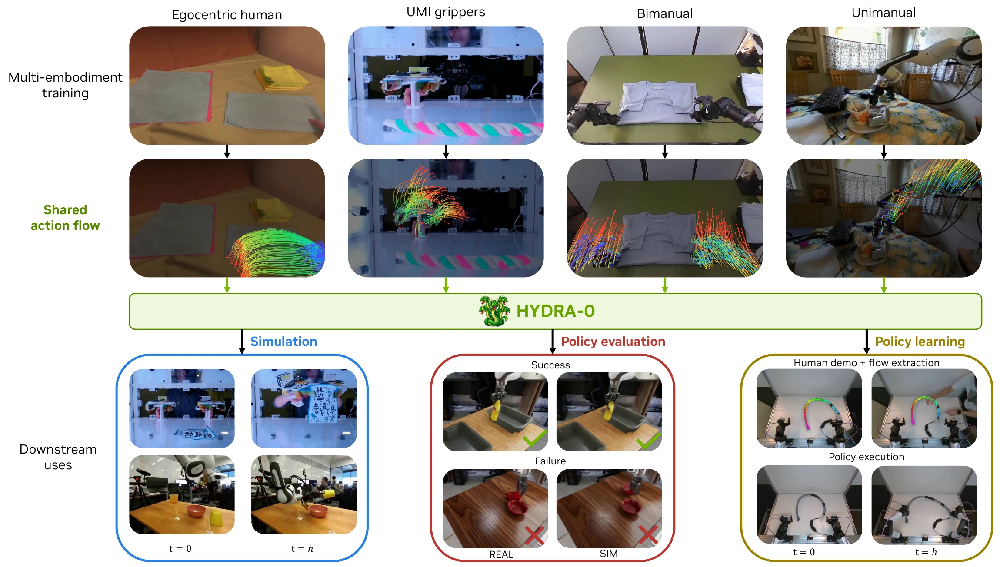

# Hydra-0：以图像动作流连接世界预测与机器人控制

> 论文原图：人类手部、UMI 夹爪和多种机器人动作流进入共享 Hydra-0 世界模型，并连接仿真、策略评测和策略学习。

## 核心问题与分类判断

Hydra-0 关注的是不同本体、不同动作空间如何共享一个面向机器人控制的视觉世界模型。它把动作表示成图像平面上的 Action Flow，即一组带可见性和位置轨迹的相机平面运动，而不是直接把每个机器人的关节角、末端位姿或控制频率硬编码进视频模型。这样，同一个视频预测接口可以接收人手、单臂、双臂和夹爪的运动条件，并尝试预测动作之后的视觉后果。按知识库的分类规则，它属于“物理世界建模与预测”：核心是当前视频与动作流到未来视觉状态的条件预测，同时带有逆向控制和策略评测用途；NVIDIA 的 Video-to-Data 是相关数据与仿真基础设施，不等于 Hydra-0 的完整训练工程。

## 输入、输出与两条动作流路径

正向模式输入当前或历史 RGB 视频、机器人或人体动作流以及可选的本体/物体轨迹条件，输出未来视频潜变量或未来视觉帧。动作流可以来自真实视频跟踪，也可以由机器人几何、相机标定和候选控制命令投影到可见表面点后得到。几何感知路径使用机器人几何和相机标定传播表面点；纯视频路径则使用密集跟踪与物体 mask，不要求视频里显式提供机器人描述。论文还使用 primary action、object action、all 和 none 等条件 dropout，使模型既能预测本体运动，也能在给定目标物体流时尝试反推出兼容的机器人运动。

在线部署不是让模型直接替代控制器。Isaac Lab 先执行候选命令序列，通过物理仿真得到机器人链接变换，再把可见表面点投影为 action flow，Hydra-0 因果地预测后续视觉结果。逆向模式则从留出的人类示范中取目标物体流，寻找兼容的机器人运动，再交给动作头生成可执行命令。图中的 policy evaluation 主要是把策略轨迹重放给世界模型，检查模型能否保持已知轨迹的运动关系，不应误读成对未知动作的闭环成功率。

## 训练与实验条件

训练混合 DROID、ABC-130k、MolmoAct2、EgoDex、Deform360、XVLA-Soft-Fold 和 H1-Fold-Clothes 等来源，统一为 480p、16 fps、约 81 帧即 5 秒的窗口。论文报告总量约 1,565,634 个窗口、2,201.7 小时，但各来源许可和动作流质量不同。模型实验覆盖 Cosmos 2.5、Wan2.2 I2V A14B 和 TI2V5B 等视频骨干；正向动作流条件未来视频，因果 rollout 使用分块预测和四步蒸馏。世界模型的共同视觉接口是论文的主要工程价值，不代表所有本体都共享同一套原生关节控制器。

在运动误差比较中，最佳设置相对动作条件基线把机器人运动误差降低 90.4%，物体运动误差降低 60.2%。这两个数字是 motion error，不是 success rate。RoboLab 使用 5 个策略、6 个任务、共 300 个 episode 的轨迹重放，世界模型预测与真实/参考成功结果的 Pearson 相关系数为 0.96、Spearman 为 0.93，平均绝对差约 5.7 个百分点；模拟汇总成功率约 26.3%，真实汇总约 26.7%，每 episode 判断一致率约 93%。这些证据支持它做策略排序或失败预检，但仍是以已知轨迹为主的开放环评测。

逆向控制提供了柔性管道等真机概念验证：从人类动作流获取对象目标，再由机器人动作头执行，不需要针对每个任务额外采集专家机器人示范。不过论文没有把这一小规模 proof-of-concept 等同于跨任务的稳定真机成功率；深度、触觉、力和接触状态也没有被 Action Flow 完整表达。

## 开源边界与开发建议

官方 Video-to-Data 仓库和文档公开了视频摄取、实体图、SigLIP 嵌入、重建容器、深度/mask/mesh/6D 位姿以及 Isaac Lab 相关数据管线；根目录 LICENSE 汇集多项许可和第三方条款，本库将其归为混合许可。官方 Hydra-0 页面仍标注代码链接后续发布，robotic grounding 文档也不是完整 Hydra-0 训练实现。因此记录为“相关基础设施部分开放”，不能写成 Hydra-0 训练代码和全部数据已按单一许可证开放。

落地时建议先把 action flow 当作评测和数据接口，检查相机标定、可见点覆盖、遮挡和轨迹重放误差，再接逆向动作头。策略排行榜应明确是 open-loop replay、运动误差还是闭环 SR，并给出每个任务的分母。对接 Video-to-Data 时还要逐项核对第三方许可证、容器版本和数据来源许可；对真实接触任务，应另外增加深度、力/触觉和碰撞安全层，不要让视觉未来预测单独承担执行保证。

## 官方来源

- [arXiv 摘要页](https://arxiv.org/abs/2608.18077)
- [arXiv HTML 正文](https://arxiv.org/html/2608.18077v1)
- [Hydra-0 官方项目页](https://nvidia-isaac.github.io/video_to_data/hydra-0/)
- [Video-to-Data 官方项目主页](https://nvidia-isaac.github.io/video_to_data/)
- [官方 Video-to-Data GitHub 仓库](https://github.com/nvidia-isaac/video_to_data)
