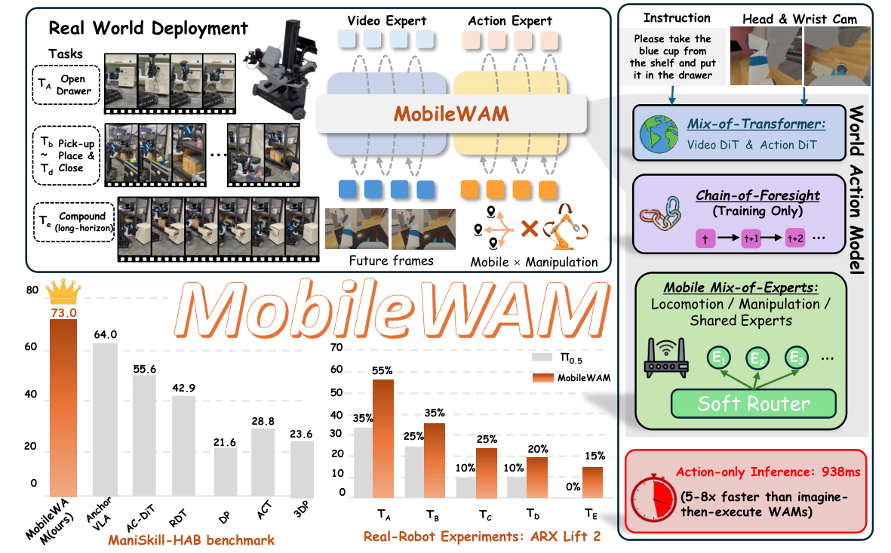

# MobileWAM：用训练期未来信念支持移动操作

> 论文原图：视频专家与动作专家的联合注意力、训练期 Chain-of-Foresight，以及面向移动操作的 Mobile MoE。

## 核心问题

MobileWAM 讨论的不是固定底座机械臂简单加一个移动命令，而是 World Action Model 的视频预测能力如何真正服务于移动操作。底盘移动会改变观察视角，机械臂和底盘又有不同的动作尺度；如果视频专家和动作专家分离，未来视觉表示未必会帮助当前动作。如果在推理时完整生成未来视频再执行，又会牺牲控制延迟。论文因此把视频 token 与动作 token 在多层中联合处理，训练期加入 Chain-of-Foresight，让模型在内部递归地传递未来信念，同时用 Mobile Mixture-of-Experts 将共享、移动和操作因素分开路由。

## 输入、输出与结构

WAM 输入语言、两路相机的当前视觉和带噪动作块，视频专家使用 3D VAE 的潜变量，动作专家把机器人状态加入文本条件。视频主干为 30 层、宽度 3072 的扩散 Transformer；一个视频潜变量时间点对应一个动作块，当前帧为干净 latent、未来帧为带噪 latent。动作专家宽度约 1024，在全部 30 层与视频 token 做 lockstep shared self-attention，输出长度 H=4 的动作块。这个接口让视觉未来和动作去噪在同一层级交流，而不是先生成一段视频再另起一个策略。

Mobile MoE 用共享 expert、locomotion expert 和 manipulation expert 替换前馈层，由带噪动作嵌入的均值经过 soft router 给出软权重；零初始化有助于从原有 WAM 行为平稳适配。CoF 从第 4、12、20、30 层抽取中间表示，用两层 MLP/Transformer 风格的递归链让下一次未来 latent 条件化于前一次 belief。它是训练辅助，不是部署模块。部署时只编码当前帧并缓存一次视觉条件，移除未来视频生成和 CoF 递归，直接走动作专家，所以论文的约 938 ms 指的是 action-only policy inference，不应当写成包含相机、控制器和执行器的完整系统延迟。

## 训练与推理

论文在 ManiSkill-HAB RGB-only 任务上做单阶段训练，并将 Mobile MoE 与 CoF 一起加入 WAM 的视频/动作学习目标。CoF 的价值在于给动作专家提供训练期的长时域信念约束，推理时不需要显式未来帧，因此它和“在线想象多步视频”的世界模型规划器不同。输入仍然需要相机视角、语言、状态和动作噪声符合预训练接口；移动底盘的速度约束、机械臂限位和稳定控制仍由机器人执行层负责。

真机平台是 ARX Lift2，论文用逐步增加任务时域的移动操作任务检验长程效果；仿真平均成功率为 73.0%，图中还对比了 pi0.5 在真实任务上的趋势。仿真消融在有限 5,000 步预算下，原始 WAM 平均成功率为 50.2%，并行未来为 52.3%，简单 MLP CoF 为 46.3%，递归 Transformer CoF 为 58.2%，说明 CoF 的结构和训练预算都影响结果，不能只把“有 foresight”当成充分解释。论文还报告 action-only 推理比 generate-then-act 的 WAM 方案快约 5 到 8 倍。

## 实验边界

ManiSkill-HAB 是 RGB-only 仿真基准，真机证据集中在 ARX Lift2 及论文列出的任务，不能直接外推到任意人形全身控制、复杂接触或无标定相机。Mobile MoE 只是动作专家的表示和路由结构，不是底盘平衡、足端接触或全身控制器。CoF 被删除后，部署端的收益来自训练得到的参数，而不是运行时继续观察未来；复现实验时若误把 CoF 递归保留，会改变论文宣称的延迟和资源条件。

论文摘要写明代码将在接收后发布，截至本次核验尚未发现可确认的官方训练仓库，因此不能把论文原图或仿真结果标为已经开源。ARX Lift2 的真实成功率图适合做相对趋势参考，但在采用前应重新取得任务定义、成功判据和每项试验分母。尤其要把策略推理 938 ms、控制周期、相机采集、动作块执行和恢复时间分列记录。

## 开发建议

如果已有视频动作模型，最值得复用的是“视频/动作多层联合注意力 + 训练期未来信念 + 移动/操作软路由”的组合，而不是直接照搬网络宽度。先在统一 RGB、固定动作块和同一控制频率下比较原始 WAM、并行未来、MLP CoF 与递归 CoF，再加入移动底盘；同时观察失败是否来自视角自运动、抓取时序还是底盘轨迹。部署前删除所有未来帧路径，做真实端到端延迟剖析，并为移动底盘保留独立的速度限幅、碰撞检测和稳定控制。

## 官方来源

- [arXiv 摘要页](https://arxiv.org/abs/2608.04657)
- [arXiv HTML 正文与 Figure 1](https://arxiv.org/html/2608.04657v2)
