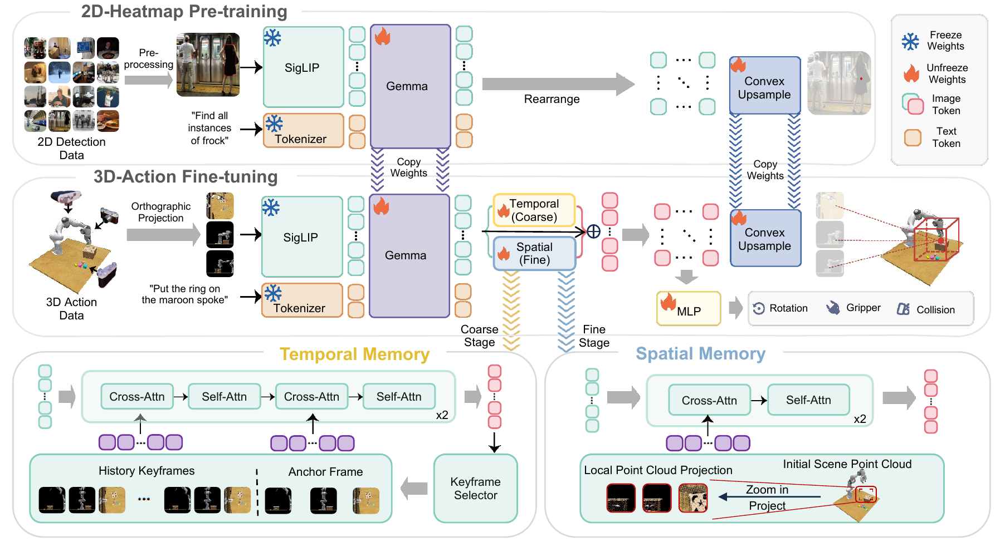

# BridgeVLA++：让三维操作策略记住已经发生的交互

> 这一页回答：当当前相机帧看不出已经完成了哪些子目标，或者目标被机械臂遮住时，VLA 如何利用有限的历史和场景几何继续执行。

BridgeVLA++ 是在 BridgeVLA 动作接口上增加时空记忆的视觉语言动作策略。它被放在“世界模型VLA与Agent”的“记忆、规划与任务调度”子类，是因为记忆用于判断进度、保留子目标和恢复被遮挡的空间上下文；但它并不是一个可以自由生成未来视频、预测完整动力学的生成式世界模型。论文的主要贡献是把记忆注入视觉语言模型的 token 流，同时尽量不改动原有的 2D 热图预训练和 3D 动作微调路径。

## 核心图与问题拆解

> **主要方法图：** 官方项目页的架构图，展示 2D 热图预训练、3D 动作微调，以及粗粒度时间记忆和细粒度空间记忆的注入。来源：[官方架构图](https://bridgevla-plus.github.io/static/images/paper/architecture.png)。图中记忆模块是训练和推理都要理解的结构，但不应据此推断策略会在线生成一段未来视频。

普通单帧策略只看到当前 RGB 或多视角观察，难以回答“已经放入的物体是哪一个”“上一步是否完成了插入”“遮挡后目标原来位于哪里”。BridgeVLA++ 把问题拆成两个时间尺度。时间记忆在粗阶段读取初始锚点、最近邻关键帧和已识别的子目标关键帧，补足任务进度；空间记忆在细阶段保存初始场景的彩色点云，并按照当前要预测的动作位置重新投影局部几何，降低手臂或物体遮挡造成的定位错误。两者都工作在 VLM 的视觉 token 空间，所以输出仍可以接原来的动作头。

## 输入、输出与记忆更新

输入包括语言指令、多视角图像以及由场景观察构造的空间信息；在官方真机设置中使用静态 ZED 2i 双目相机。策略的输出是面向三维操作的动作预测，图中可见旋转、夹爪和碰撞相关输出，实际执行还要经过动作表示对应的运动规划与机器人控制接口。也就是说，它解决的是任务级三维动作生成，不是直接输出关节力矩，也不替代安全限位、逆运动学或底层闭环。

时间记忆的输入窗口不是无限增长的。论文实验中，一般任务使用较小的记忆预算，RMBench 的设置为总槽位 K=12，其中保留 2 个邻近帧，其余槽位由关键帧选择器保留子目标里程碑。推理开始时建立初始锚点并用零填充记忆槽；每次获得新观察后，把它加入邻近缓冲区，再由 selector 判断是否提升为子目标关键帧。空间记忆只保存初始场景点云 P0，利用相同的预测航点和正交视图重新渲染局部投影，从较少遮挡的视角恢复几何线索。这个设计的工程含义是内存预算和关键帧保留策略会直接影响延迟、上下文污染和长任务稳定性。

## 训练与推理边界

训练阶段从示范轨迹的历史观察构造时间记忆和初始点云，并对当前观察、记忆帧和动作使用一致的刚体增强；主损失是动作损失，关键帧选择另有二元交叉熵目标。粗阶段的时间块和细阶段的空间块通过交叉注意力、自注意力把记忆特征注入视觉表示，参数开销约为时间块 168M、空间块 84M、选择器 18M。推理阶段不需要示范的未来真值，也不更新参数，只维护当前 episode 的帧缓存和初始点云。开发时应区分“训练时如何构造记忆标签”和“部署时如何从传感器流在线更新记忆”，否则很容易把离线可用的未来信息泄漏进评测。

## 实验条件与证据

论文和官方页面报告了 RLBench 93.7%、COLOSSEUM 65.2%、GemBench 51.1%、RMBench 96.0% 和 MemoryBench 99.7% 等结果，覆盖普通三维操作、分布外变化和依赖记忆的任务。真机使用 Franka Research 3 做一般操作，使用 Dobot CR5A 做记忆任务；记忆套件包含 Cover Blocks、Press Button、Swap Eggplant 等任务，并设置 Basic、Distractor、Background、Height、Lighting 五类变化。每条语言指令使用 10 条示范，通常每个设置做 10 次试验。官方论文 HTML 对基本记忆设置报告 BridgeVLA++ 平均 93.3%，移除记忆的 BridgeVLA 为 20.0%。这些数字说明记忆对该类测试有效，但不等于在任意长时任务上都能可靠地识别阶段完成。

## 边界、开源与开发建议

当前证据主要来自仿真和受控机械臂部署，不覆盖人形机器人行走、全身平衡、动态接触或移动基座。静态外部相机、预定义任务和下游规划器会吸收一部分真实系统复杂度；空间点云也依赖视觉重建，不是力觉或触觉观测。BridgeVLA-Seq 官方仓库标注 Apache-2.0，但已于 2026-08-08 被所有者归档为只读，因此可把它作为可复现实验入口，却不应把“仍能访问”理解成持续维护承诺；图像单独的许可仍应以仓库和项目页说明为准。

若要接入新平台，建议先做四组消融：当前帧、时间记忆、空间记忆、两者同时启用，并固定动作头、相机标定和低层规划器。记录关键帧选择错误、遮挡恢复错误、动作执行错误和控制器拒绝动作的首个失败点。对长任务要限制记忆槽位、清理过时帧、验证相机外参和点云坐标系；对人形系统则把该策略放在上层任务动作接口，另行接入全身控制、碰撞检查与接触安全策略。

## 原始来源

- [论文与版本历史](https://arxiv.org/abs/2608.05042)
- [官方项目页](https://bridgevla-plus.github.io/)
- [官方代码仓库 BridgeVLA-Seq（已归档）](https://github.com/npucvr/BridgeVLA-Seq)
