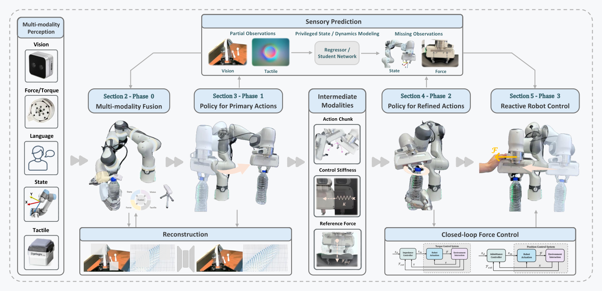

# TF-ART：把触觉、力觉学习拆成可核验的闭环

> 本页的子类是“接触力控与负载适应”。它回答的不是某个新控制器怎么训练，而是如何沿着传感器、表示、动作生成、动作修正和机器人末端控制，比较触觉/力觉机器人学习系统各自承担了什么。

TF-ART（Tactile- and Force-Aware Robot learning Taxonomy）是一篇综述。它把触觉、力/力矩、视觉、语言、本体状态等输入，放进一个多模态、多阶段的统一框架，再把从高层策略到低层反应控制的接口显式化。知识库将它归入 LocoManip 与物理交互，而不是把它误记成新的数据集、新的策略网络或已经可以直接部署的统一控制器。配套 GitHub 是 53 篇代表性工作的整理清单，论文和项目页都没有声称这 53 篇共享一套训练代码。

## 核心图：从接触观测到末端控制

> **主要方法图：** 官方项目页的 overview，展示多模态感知、传感器预测、融合、主动作生成、动作修正和反应式机器人末端控制。来源：[官方 overview 图](https://lorenzo-0-0.github.io/tactile-force-survey/assets/images/teaser.png)。这是综述框架图，不是作者训练出的单一模型。

它所要解决的痛点是研究之间的“接口不可比”。一项工作可能用腕部六轴力/力矩传感器预测末端轨迹，另一项用触觉图像修正抓取动作，第三项直接把参考力送进阻抗控制；如果只比较模型名称或成功率，就无法知道差异来自感知、融合、策略还是低层控制。TF-ART 采用 Phase 0 到 Phase 3 的顺序，把一条接触闭环拆开，使读者能够沿着信号流追踪信息在哪里被压缩、补全或交给控制器。

## 输入、表示与输出

输入侧不仅有 RGB 或深度图，还包括语言、关节/末端状态、腕部或关节力矩、外部六轴力/力矩和触觉图像。综述区分静态接触/压力分布、滑动或探索产生的动态触觉，以及负载、接触方向和环境反力等力觉信号。工程上需要同时记录传感器坐标系、采样频率、时间戳、滤波延迟、零点漂移和接触事件；否则“融合”可能只是把不同步的信号拼到一个张量里。

Phase 0 负责多模态表示与融合，也包括从部分观测重建缺失模态、从 privileged state 或动力学模型蒸馏传感器线索。Phase 1 是主动作生成，可输出末端位姿、关节动作、动作块、抓取参数或技能条件。中间模态包括 action chunk、控制刚度和参考力。Phase 2 以当前接触和力觉反馈对主动作做残差、重规划或方向修正。Phase 3 才是反应式机器人末端控制，常见实现包括位置/力混合控制、阻抗、导纳、PD 或 PID。因而“策略预测了力”与“机器人闭环施加了稳定的力”是两个不同的证据层级。

## 训练、推理与实验口径

TF-ART 本身没有一套统一的训练和推理算法。它归纳了监督模仿、表示学习、缺失模态预测、特权状态蒸馏、动作生成与控制器耦合等配方；具体论文可能只覆盖其中一个阶段，也可能把学习策略与解析的阻抗/导纳控制串联。综述的证据来自文献和任务基础设施的横向整理，而不是在同一个机器人、同一批轨迹、同一个传感器标定下重新跑出的排行榜。因此不能从 TF-ART 的框图读取一个统一的输入维度、控制频率或成功率。

项目页说明框架覆盖 266 篇参考文献，其中 53 篇进入代表性框架/语料整理；GitHub 的 53 项是综述文献和资源索引，不是 53 个可直接训练的模型。阅读实验结果时，应回到被引用论文，确认是真机还是仿真、是否有触觉/力传感器、控制器频率和是否使用了接触状态真值。综述可以帮助建立比较表，但不能替代单篇论文的复现实验条件。

## 边界与开发建议

综述没有证明任何特定传感器在所有负载、材料和接触速度下都优于视觉，也没有解决触觉标定、传感器磨损、接触安全和 sim-to-real 的统一方案。力觉信号的改善可能来自更好的控制器，而不是策略本身；高成功率也可能掩盖峰值接触力、滑移、夹具损伤或恢复失败。对于人形或移动操作，脚底接触、基座扰动和全身力分配还需要额外的动力学层，不能由末端接触分类直接推出。

把它用于开发时，建议先画出本项目的五段契约：观测与同步、表示与融合、主动作、动作修正、机器人末端控制。为每段写清输入输出、刷新率、延迟上限、坐标系、饱和/急停条件和失败回退；训练评测同时报告任务成功、接触力峰值、滑移或碰撞率、恢复时间和传感器失效表现。若没有触觉或力传感器，应把该缺口标记为未覆盖，而不是用视觉估计结果冒充真实接触证据。

## 原始来源

- [论文与版本历史](https://arxiv.org/abs/2608.07558)
- [官方项目页](https://lorenzo-0-0.github.io/tactile-force-survey/)
- [官方综述资源清单](https://github.com/NTUMARS/Awesome-Tactile-Force-aware-Robot-Learning)
