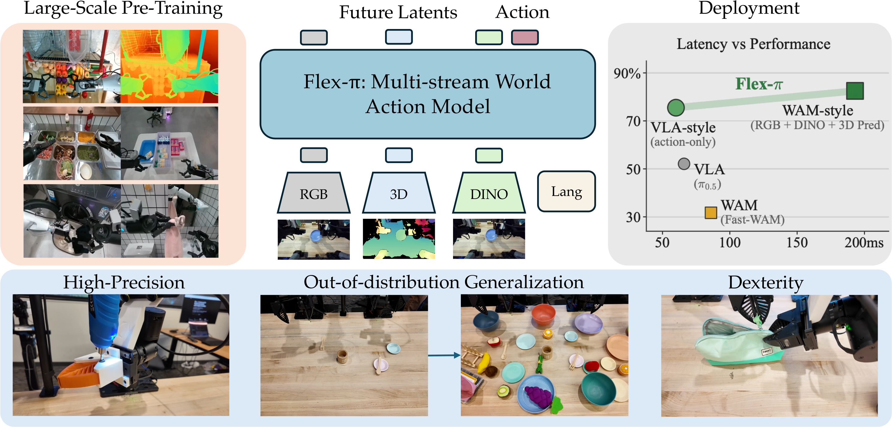

# Flex-π：让同一个世界动作模型按计算预算选择输出流

> 这一页回答：动作策略是否必须固定只读 RGB，或者每次都预测完整的未来视觉状态；Flex-π 如何在 RGB、三维几何、语义特征和动作之间共享一个检查点。

Flex-π 将世界动作模型（World-Action Model, WAM）做成多流结构。它不把图像只压成服务动作的隐变量，而是联合去噪当前观测对应的 RGB、三维 pointmap、物体级 DINO 语义特征和机器人动作，并通过训练时的流丢弃，让部署者按延迟和效果选取输入/输出组合。它被放在“世界模型VLA与Agent”的“动作生成与通用策略”子类，因为它最终要输出连续动作块；同时预测未来视觉流使它具备严格意义上的世界动作建模成分，而不是只在标题中使用“world”。

## 核心图与信号流

> **主要方法图：** 官方仓库提供的论文 teaser，展示 RGB、3D、DINO 和语言输入，经同一 Flex-π 模型产生未来潜变量与动作，并比较 VLA-style 动作模式和 WAM-style 多流模式。来源：[官方仓库图源](https://raw.githubusercontent.com/geyan21/flex-pi/main/assets/flexpi_teaser.png)。

在每个时间步，输入可包括多视角 RGB、pointmap、DINO 语义 patch token、语言指令和本体状态。pointmap 由 RGB 通过 Depth Anything 3 获得，因此不是新增的深度传感器；DINO 流也不是触觉或真实物理状态。视觉 latent 使用冻结的 Wan-2.2 VAE，语言由冻结的 umT5 编码。模型约 6B 参数，主体视觉/世界建模部分初始化自 Wan-2.2-5B，并配有较轻的动作 expert。Mixture-of-Transformers 在中间层进行跨流注意力，动作 expert 读取视觉和条件特征，但视觉 token 不反向读取动作 token，避免把动作标签泄漏为视觉预测依据。

## 训练方式与计算弹性

预训练数据约 500 小时，来自 AGIBOT World-Beta 的 100 个任务，记录频率为 30 Hz，包含头部和双腕相机；随后再做任务域微调。RGB、pointmap、DINO 和动作都通过 flow matching 的联合去噪目标训练，论文给出的主损失权重相同，DINO 使用 x-prediction。每个样本以 0.5 的概率独立丢弃视觉输入流，同时至少保留一个视觉流；输出注意力掩码控制动作可以读取哪些未来视觉流，但被省略的输出流仍参与训练。这使一个检查点能够覆盖从 action-only 到完整联合预测的多种模式，项目说明约有 56 种输入/输出组合。

推理时先选择要激活的输入与未来输出流，再进行 K 步 Euler flow sampling。action-only 模式只生成动作，适合低延迟控制；WAM-style 模式还生成未来 RGB、几何和语义 latent，代价是更多采样和显存。动作块长度为 32；项目和论文报告 action-only 调用约 60 ms，并指出联合模式相对单纯动作模式会增加延迟，但在若干任务上带来约 13 个百分点的性能收益。这里的“计算弹性”是推理路径的选择，不是运行中动态改变训练参数。

## 实验条件与证据

仿真评测覆盖 RoboTwin 2.0 的 50 个任务、LIBERO 四个套件以及 LIBERO-Plus 的七个分布偏移轴；真机使用 YAM 双臂平台，包含 Put Plate on Rack、Sort Utensils、Kitchen Organization、Self-Repair Gripper 和 Soft-Bag Zipping 等五类灵巧操作。论文报告 action-only 与 full-joint 在 LIBERO 上都接近 98% 的成功率，并展示完整多流模式在更高精度、出分布和灵巧任务上的优势。真实任务中的精细间隙、软袋和多阶段修复更能体现未来表示是否提供了额外帮助，但样本仍来自有限机器人和固定任务集合，不能直接外推到任意人形平台。

## 边界与开发建议

Flex-π 的未来 RGB、pointmap 和 DINO latent 是模型内部的预测表示，不是对接触力、摩擦系数或动力学稳定性的形式化保证。pointmap 的几何质量受深度估计影响，语言和视觉流的联合生成也不等于具备高层规划。真机动作仍要通过 YAM 接口和低层控制执行，动作流没有替代碰撞检查、力限幅或急停机制。延迟和显存数字绑定 RTX 4090、采样步数、流组合和实现细节，不能当作所有硬件上的固定控制频率。

复现时应分别跑 action-only、RGB+action、RGB+3D+action 和 full-joint，记录每次采样的流、步数、显存、端到端延迟和动作成功率。检查 pointmap 的尺度、相机外参、未来窗口和动作时间戳是否对齐；再做去掉 DINO、去掉未来视觉监督和改变流 dropout 的消融。若目标是人形系统，建议把它作为上层动作策略或短视界预测器，另配本体状态估计、接触检测和全身执行器控制，并将未覆盖的力学边界写入部署门槛。

## 原始来源

- [论文与版本历史](https://arxiv.org/abs/2608.10860)
- [官方项目页](https://flex-pi.github.io/)
- [官方代码仓库 Flex-π](https://github.com/geyan21/flex-pi)
