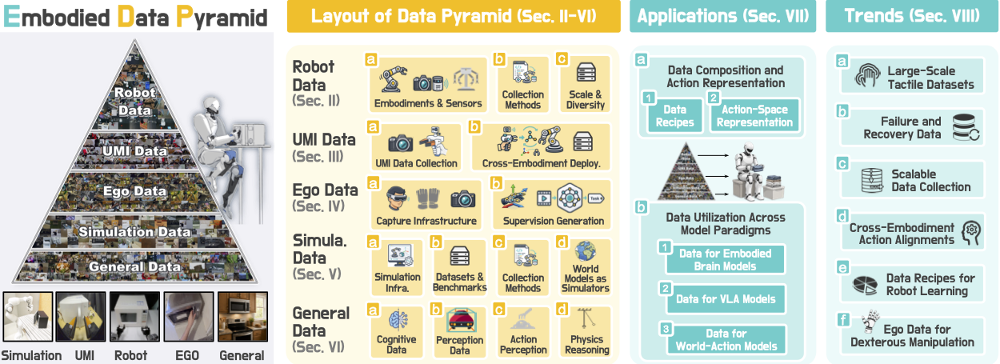

# Data Pyramid：按可扩展性与机器人对齐组织具身操作数据

> 这一页回答：具身操作数据为什么不能只按轨迹数量或小时数比较，以及不同来源进入 VLA、世界动作模型和人形训练前需要补上哪些动作与几何对齐。

Data Pyramid for Embodied Manipulation 是综述，不是作者新采集的数据集，也不是一个可以直接运行的训练框架。它把具身操作数据按来源和使用方式组织成五层：真实机器人数据、UMI-style 数据、第一视角/第三视角人类数据、仿真数据和通用视觉语言数据。金字塔的高度是组织结构，不是从底到顶的质量排行榜；每类数据在质量、多样性、可复用性和物理保真之间都有不同取舍。知识库将它放进“动作数据入口与重定向”的“人形训练数据构建”子类，是因为综述把来源、采集方式、动作表示和跨本体部署放在同一个数据契约里讨论。

## 核心图与五类数据

> **主要方法图：** 官方资源仓库中的 data pyramid overview，对应论文对五类数据源、数据配方和应用方向的组织。来源：[官方资源图](https://raw.githubusercontent.com/worldbench/awesome-embodied-data-pyramid/main/assets/data_pyramid.png)。图中是综述分类和资源索引，不应被当作新数据集的发布图。

金字塔顶层的真实机器人数据通常包含相机、机器人状态和动作，物理保真与机器人对齐最好，但采集昂贵、硬件和本体受限。UMI-style 数据通过可携带的人类操作接口获得相对末端轨迹，降低对目标机器人在线示教的依赖，代价是需要重定向、尺度处理和碰撞检查。第一视角或第三视角人类数据在数量和语义覆盖上有优势，能提供手-物交互和任务分解线索，但多数缺少机器人动作、精确位姿、力觉和可执行轨迹。仿真数据可以规模化生成动作、物体状态、分割和特权动力学标签，却面对渲染偏差、接触模型误差和 sim-to-real。通用视觉语言数据适合补充物体、语言和场景语义，通常与机器人动作和接触物理的距离最远。

## 输入输出与对齐问题

综述的重要贡献不是给每层指定一个固定模型，而是提醒数据入口要同时记录观察、动作和几何的关系。对真实机器人和 UMI 数据，需要保存时间戳、相机内外参、机器人本体、末端坐标系、夹爪状态、动作频率和示教接口；对人类视频，必须明确是否只有视频、是否有手部关键点、是否能恢复深度，以及动作是绝对位姿、相对位移、关节位置还是技能标签。跨本体重定向还要说明末端可达性、关节限位、夹爪语义、接触点和时间尺度。

动作自由的数据不是无用，但它不能未经处理地被当作机器人动作监督。它更适合作为视觉/语言表征、目标识别、轨迹先验或世界模型的预训练来源，再用少量机器人对齐数据学习从观测到动作的映射。反过来，大量机器人轨迹也可能只覆盖窄任务、单一本体或成功示范，不能因为动作字段存在就自动具有多样性。Data Pyramid 用“可扩展性—机器人对齐”两条轴来表达这种张力，并进一步把 action-space alignment 与 geometric alignment 分开。

## 训练、推理与论文证据

论文分析的是已有具身大脑、VLA 和世界动作模型的数据配方：哪些来源用于表征预训练，哪些用于动作监督，哪些用于跨本体迁移或下游微调。它没有提出统一的损失函数、采样器、重定向器或推理 API，也没有在同一数据预算和同一机器人上重新训练一个模型来给出总榜。官方项目页和资源仓库提供数据表、图表及外部数据链接，价值在于建立检索与比较入口，而不是提供作者新采集的“金标准”数据集。将该条目标成 survey，同时把资源仓库标成开放清单，比把它记成“新数据集”更准确。

综述指出的数据缺口包括大规模触觉数据、失败与恢复数据、可扩展采集、跨本体动作对齐、灵巧操作的第一视角迁移，以及可解释的数据配方。它们也说明实验条件不能只写“多少小时”：应写清机器人数量、传感器、动作表示、成功/失败比例、场景变化、许可证和是否含接触监督。对人形训练尤其要追踪上肢动作与全身状态之间的缺失接口。

## 边界与开发建议

金字塔不是单调质量分级，不能用顶层或底层位置推导泛化性能；同一层数据的质量、授权、标定和动作可执行性可能差别很大。人类视频到机器人动作仍需要深度、手物对应、视角转换、接触时序和本体约束，仿真标签也不能替代真实摩擦、柔性和传感器噪声。综述没有证明某一种混合比例在所有 VLA 或人形模型上最优。

实际构建数据时，建议先建立一张数据矩阵：来源、观察模态、动作字段、坐标系、时间频率、失败标签、接触/力觉、机器人本体、许可证和重定向状态。把模型预训练数据与动作微调数据分开评测，固定总小时数后分别增加语义多样性、机器人对齐度和失败覆盖，报告每一项对成功率、恢复率和长时稳定性的影响。对人形系统，先把 UMI 或人类视频转成可检查的末端/手部目标，再经过全身可达性、碰撞和接触约束，最后才写入训练集，避免把不可执行的轨迹当作有效动作入口。

## 原始来源

- [论文与版本历史](https://arxiv.org/abs/2607.24744)
- [官方项目页](https://jasper-aaa.github.io/embodied-data-pyramid/)
- [官方资源仓库](https://github.com/worldbench/awesome-embodied-data-pyramid)
