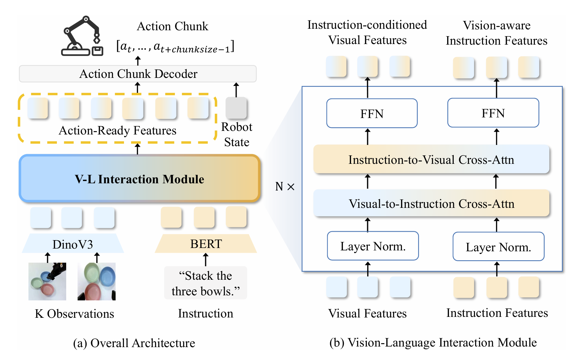

# TurboVLA：把视觉语言直接送入低延迟动作解码器

> 这一页回答：执行级语言指令是否必须经过大语言模型才能得到连续机器人动作，以及 TurboVLA 的低延迟数字具体对应什么输入、输出和硬件条件。

TurboVLA 把常见的 V→L→A 路径改成直接的 V+L→A：视觉和语言分别编码，经过轻量的双向视觉语言交互后，由紧凑的 ACT-style 解码器一次生成连续动作块。它归入“世界模型VLA与Agent”的“动作生成与通用策略”，因为核心产物是语言条件动作策略，而不是未来场景预测或任务调度器。它的价值在于把执行级语义对齐和动作生成放在一个较小的在线路径中，适合对响应时间和显存有硬约束的机械臂系统。

## 核心图与输入输出

> **主要方法图：** 官方仓库的 architecture overview，对应论文 Figure 3，展示 DINOv3 视觉编码、BERT 指令编码、双向交叉注意力、机器人状态注入和 action chunk decoder。来源：[官方架构图](https://raw.githubusercontent.com/H-EmbodVis/TurboVLA/main/assets/figures/architecture-overview.png)。

每个时间步的输入是一个或多个相机图像、自然语言指令和当前机器人状态。图像由 DINOv3 编码，保留空间 token，并加入位置与相机视角编码；文本由轻量 BERT 编码，保留物体、属性和空间关系的 token，而不是只取一个句向量；本体状态单独经过投影，直接送入动作解码器。视觉与语言特征投影到 256 维共享空间，经 6 层双向 cross-attention：视觉到语言让指令看到当前场景，语言到视觉让目标对象和关系选择相关区域。两路更新后的 token 与状态一起进入 ACT-style transformer，输出 H 步连续动作块，所有 action query 并行解码，没有动作 token 的逐步自回归。

## 训练和推理

论文采用行为克隆与 L1 动作损失，不需要额外的语言模型生成目标；实现使用四张 RTX 4090，学习率为 5×10^-5。LIBERO 配置使用 DINOv3 ViT-B、四套件混合训练、7 自由度连续动作和 12 步动作块，训练 80k 步、10k 步 warm-up、有效 batch size 256。RoboTwin 2.0 使用 DINOv3 ViT-L、三路相机、14 维绝对关节位置动作和 50 步 ACT chunk，在干净设置下训练 55k 步、1k 步 warm-up、有效 batch size 192。真机从 LIBERO checkpoint 初始化，再用 4×65 条遥操作示范微调 12.5k 步。

推理流程是相机采样、DINOv3/BERT 编码、六层双向交互、状态注入和一次动作块解码；执行若干步后重新观察，形成闭环。论文在单张 RTX 4090、batch size 1 的口径下报告 0.2B 参数、31.2 ms 端到端策略延迟、0.9 GB 推理显存和 LIBERO 平均 97.7% 成功率；RoboTwin 多任务平均 60.2%，对应约 43.4 ms。这里的 32 Hz 是“收到多模态观察到产出动作块”的策略调用速率，不是机器人关节、力控回路或相机都必须以 32 Hz 运行。

## 实验条件与边界

评测覆盖 LIBERO 四套件、RoboTwin 2.0 的 50 个双臂任务，并在 AgileX Piper 单臂平台上测试 grab roller、move playing card away、press stapler、stack three bowls 四项语言条件操作。真机四项成功率分别为 92.5%、80%、90% 和 87.5%，每项 40 次，并与相同平台、数据和协议下的 π0.5 比较。消融显示去掉语言后平均成功率降到 70.8%，双向交互在主 LIBERO 设置达到 97.7%，动作 horizon 从 8 增到 12 后改善、继续增大则下降，说明低延迟来自具体的接口和窗口取舍，不是简单删掉模块就能复现。

TurboVLA 面向具体执行级指令，论文明确承认它不提供大语言模型式的复杂高层规划和长时推理。连续动作块也不是关节力矩或安全证明，必须由机器人状态接口、轨迹跟踪器、碰撞检查和急停链路执行。32 Hz、31.2 ms 和 0.9 GB 都依赖 RTX 4090、模型配置、输入视角、batch size 和实现版本；RoboTwin 使用的 ViT-L 配置延迟已经不同。官方仓库已发布训练、评测代码和 checkpoint，标注 Apache-2.0，但部署前仍需核对依赖、相机同步、动作归一化和下游控制器。

## 开发建议

如果目标是落地实时 VLA，先用同一数据和控制器比较无交互、单向交互、双向交互，以及 H=8/12/15 的延迟-成功率曲线；同时把模型推理、图像采集、预处理、动作传输和执行等待分别计时。迁移到新机器人时，优先固定动作空间、状态顺序、相机视角编码和 chunk 执行步数，再检查 BERT 指令是否覆盖新任务中的物体属性与空间关系。对于长任务，可把 TurboVLA 作为低层执行策略，由外部规划器负责分解、记忆和失败重试；对于接触和人形全身动作，另行加入力/碰撞约束、基座和关节状态校验，不要把轻量动作解码器当成完整的机器人安全层。

## 原始来源

- [论文与版本历史](https://arxiv.org/abs/2607.27205)
- [官方项目页](https://h-embodvis.github.io/TurboVLA/)
- [官方代码仓库 TurboVLA](https://github.com/H-EmbodVis/TurboVLA)
