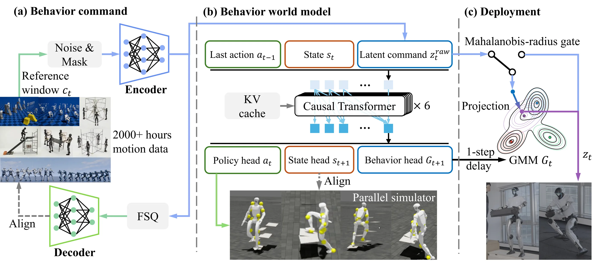

# GigaBrain-WBC-0.5：用行为预测约束环境交互中的全身动作跟踪

> 这一页回答：当参考动作要求的支撑、负载或接触条件与现实不一致时，Tracker怎样保留动作意图，同时调整无法执行的命令。

这是清华大学与极佳视界等团队发布的全身控制技术报告，主线是“基础动作跟踪器与通用运动基座”。它将动作跟踪、环境接触和跌倒恢复放进一个策略，并将预测的可行行为分布用于在线命令修正。虽然作者称其为 Behavior World Model，它不是视觉语言动作模型，也不是生成未来视频的世界模型；上层仍需提供动作参考，低层输出关节目标。官方项目页目前标注代码即将开放，因此本文是方法与证据解读，不是已经可直接复现的开源训练教程。

## 核心图与信号流

[](论文原图/P209_figure.png)

> 方法图：论文 Figure 2，取自[官方项目方法图](https://shepherd1226.github.io/gigabrain-wbc-0.5/assets/images/overview.webp)，仅转换为PNG。版权归原作者及相关权利人；此处用于署名技术解读，不代表图片获得代码许可证授权。

```text
未来参考动作窗口 → 连续命令编码 → 根据上一步预测分布检查并修正命令
                                            ↓
本体状态 + 上一步动作 + 修正后的命令 → 因果 Transformer
                                            ↓
                当前关节目标 + 下一步本体状态 + 下一步命令分布
                       ↓                             ↓
                     PD执行                 下一控制步的命令过滤
                       ↓
                  接触与本体反馈
```

Unitree G1 配置为29个执行关节，策略以50 Hz输出PD关节位置目标，而不是直接输出力矩。输入包含67维本体状态、29维上一动作，以及10个未来参考帧组成的440维窗口；参考窗口每帧间隔0.02秒，编码为64维连续潜变量。6层因果Transformer采用4个注意力头、RoPE和KV缓存，局部窗口32帧，叠层后的有效感受野为187帧。策略在线不接收相机图像、深度图或地形网格，而是从本体历史中隐式估计环境和接触对当前动力学的影响。

## 训练方法

训练用Isaac Lab中的PPO，同时优化参考重建、编码循环一致性、下一本体状态预测和下一命令分布的似然。命令预测头输出4分量对角高斯混合分布。FSQ量化与运动学解码器属于训练辅助路径；真正进入策略的是未量化的连续命令，不能将其描述为“先离散动作token，再逐token执行”。Critic使用特权信息，但不进入真机策略。

训练参考中包含相对机器人根节点的平移信息。由于真机无法保证获得对应全局状态，训练中对该信息进行随机屏蔽，部署时始终置零。平地训练使用4096个并行环境，地形和跌倒初始化训练使用512个环境；序列更新使用分离梯度的KV前缀，与采样时的历史条件保持一致。跌倒姿态课程和恢复阶段奖励门控避免机器人尚未起身时被精确跟踪惩罚压制；腕部、躯干扰动力以及质量、摩擦等随机化用于覆盖负载和动力学偏差。

另一项关键工作是把已有重定向动作加工为“动作与三维支撑几何”的配对数据：在MuJoCo中运动学回放，依据接触相关点的速度和减速寻找接触，过滤全身穿透，再用聚类和几何拟合生成楼梯、座椅、箱子等支撑体，装入Isaac Lab。它生成的是完整三维静态几何，不只是高度图，也不是在线视觉重建。三个来源分别标出12.50、22.22、37.85小时含地形动作，这是清洗前识别出的部分，不能把原始数据总时长当作全部接触配对数据。人工抽查200条动作的标注准确率为92%，仍可能受重定向噪声、短暂接触和缺失支撑影响。

## 预测怎样改变执行

上一步网络预测下一命令的分布，当前步据此判断传入参考是否偏离已学可行行为。选择混合分量后，通过Mahalanobis距离检测异常，并把偏离过大的潜变量沿径向收回椭球边界，再交给策略。这一操作发生在看到当前命令之前形成的预测分布上，避免先用当前命令预测自己、再宣称它合理。

因此预测不是只在训练中增加一个损失，而是实际影响在线控制。但是，径向收缩不等于欧氏距离意义下的最近点投影，学习出的可行域也不构成形式化安全保证。它预测的是当前策略下的下一状态与行为分布，不能据此认为已经得到能够任意查询候选动作后果的通用物理模拟器。首步、重置或行为切换后需处理缓存，第一步不进行该过滤；过滤半径决定忠实跟踪与保守修正之间的取舍。

## 实验证明了什么

下表来自论文的MuJoCo Sim2Sim评测，不是真机统计成功率。不同方法的数据与训练环境并不完全一致，属于系统级比较，不是只替换一个模块的受控消融。

| 测试条件 | GigaBrain-WBC-0.5 | SONIC | 解释边界 |
|---|---|---|---|
| 标准动作，136条 | SR 96.3%；MPKPE 76.6 mm | SR 94.1%；MPKPE 82.3 mm | 本方法根速度误差211.1 mm/s高于SONIC的189.6，并非所有指标都占优 |
| 地形交互，150条 | SR 81.3% | SR 15.3% | 检验环境支撑下的持续执行 |
| 不可行动作，136条 | SR 83.1% | SR 50.0% | 强调避免失稳，不代表准确执行物理上不可能的动作 |
| 跌倒初始化 | 恢复率99.3% | 恢复率5.9% | 使用起身并回归跟踪的专门判据，不能混同其他行的SR |

官方真机片段展示搬箱、持2 kg灭火器起身、上台阶、坐支撑物，以及支撑消失后的替代行为。它们支持环境交互和鲁棒性的定性判断，但不能替代完整试验次数、失败分布或长期运行记录。G1检查点迁移至Maker L01时进行了目标本体重定向与微调，并使用单个8 GPU节点，不是跨本体零样本部署。论文尚缺充分的组件消融和完整硬件延迟剖析，不能把全部收益单独归因于世界模型头。

## 与已有路线的关系

与[SONIC](P035.md)相比，值得跟进的增量不是简单继续扩大动作库，而是动作与三维环境配对、策略内的下一行为预测、部署时的命令过滤，以及统一恢复训练。对开发者而言，可在固定动作数据、奖励和模型容量的条件下，依次比较纯Tracker、增加预测辅助损失、增加在线过滤、增加地形配对数据四组实验，分别记录跟踪误差、接触成功、失稳率、命令修改幅度和控制延迟。这样才能区分改善来自数据、训练课程还是预测真正改变了决策。

## 原始来源

- [论文及版本历史](https://arxiv.org/abs/2608.18234)
- [论文v2完整方法与实验](https://arxiv.org/html/2608.18234v2)
- [官方项目页与真机演示](https://shepherd1226.github.io/gigabrain-wbc-0.5/)

开放状态：核验时官方项目页仍显示“Code coming soon”，尚不能确认训练代码、权重、地形构建工具和完整数据已经公开。
